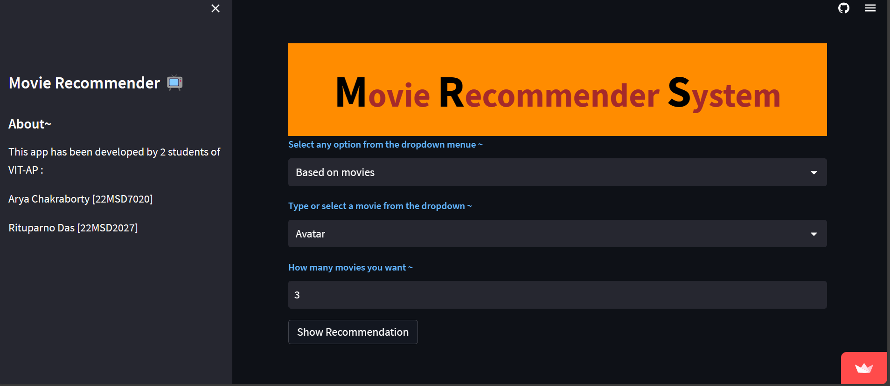

### Movie Recommender System




## Demo Video

[Watch the Demo Video](#)
## Direct Link

[Visit the Movie Recommender System](https://movierecomm.streamlit.app/) 

## How to Use

1. Clone the repository to your local machine:
   ```bash
   git clone https://github.com/yourusername/movie-recommender-system.git
   cd movie-recommender-system
2. Install Required Packages:
   ```bash
   pip install -r requirements.txt
3. Run the STreamlit App:
   ```bash
   streamlit run app.py

 ## Functionalities

- Recommends movies based on user's selection and preferences.
- Provides two recommendation options: based on movies and based on genres.
- Displays movie posters and titles for the recommended movies.

## Technologies & Concepts required
- Python
- Streamlit
- scikit-learn
- requests
- Cosine Similarity
- Moduler Coding
  

## Key Points
- Developed by [Arya Chakraborty](linkedin.com/in/arya-chakraborty2002) and [Rituparno Das](linkedin.com/in/rituparno-das-473a01198) students of VIT-AP.
- The application utilizes the [TMDB API](https://developer.themoviedb.org/docs/getting-started) to fetch movie data and posters.
- The recommendation system uses TF-IDF vectorization and cosine similarity for efficient movie suggestions.
- Users can select movies to get recommendations or choose genres for genre-based recommendations.
- The Streamlit app's layout is customized using HTML and CSS for an appealing user interface.
- The app is deployed using Streamlit sharing.
- Feel free to explore and enjoy movie recommendations tailored to your taste!

## Credits 

<p align="center">
  
  
</p>
